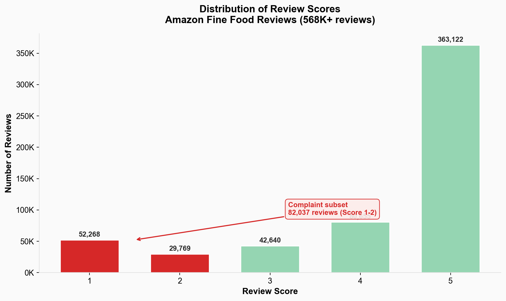
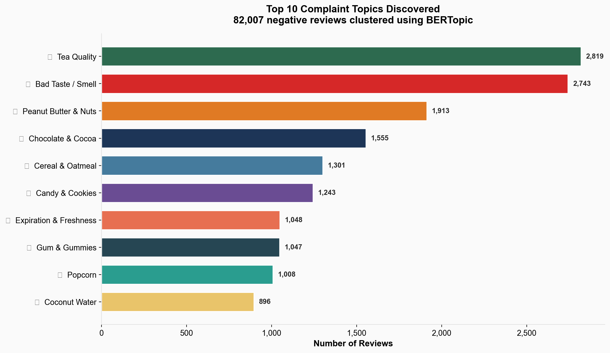
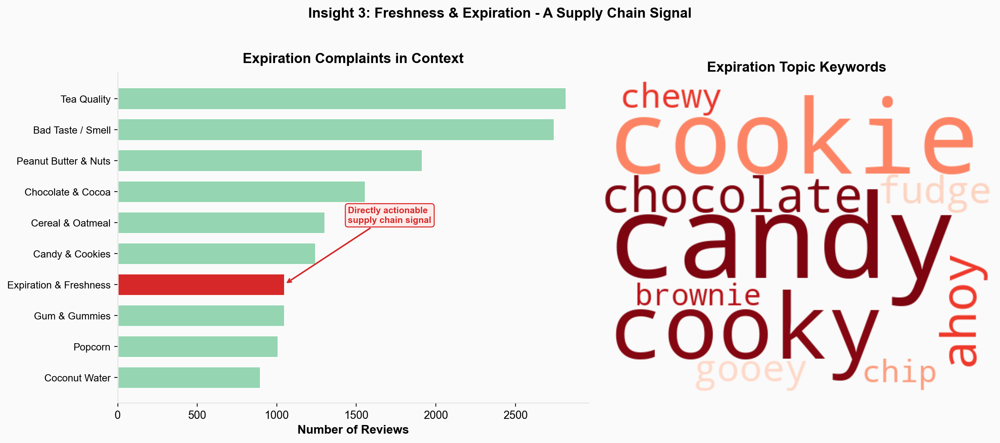
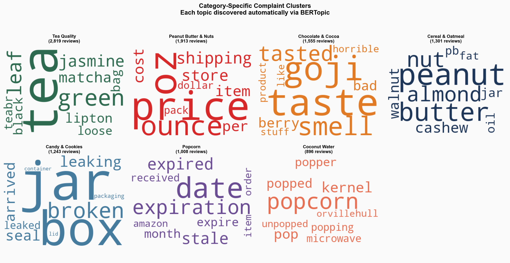

# Amazon Food Review - Complaint Topic Analysis

## Background

Amazon receives hundreds of thousands of product reviews across its food and grocery catalog. While high-star reviews confirm what's working, the real operational value lies in **negative reviews** - they surface recurring quality issues, fulfillment failures, and product misrepresentations that directly impact customer retention and brand trust. The goal of this project is to automatically discover and quantify the major complaint themes hidden within 82,000+ negative food reviews, enabling category managers and customer support teams to prioritize the right issues at scale.

## Executive Summary

Analysis of 568,000+ Amazon food reviews - filtered to the 82,007 complaint reviews (1–2 stars) - reveals distinct, interpretable complaint clusters that map directly to actionable product and operations decisions. Using BERT-based semantic embeddings and automated topic discovery (BERTopic), the pipeline identified **310+ complaint topics** without any manual labeling.

- **Top Complaint Theme:** Tea quality issues (2,953 reviews) - the single largest cluster of dissatisfaction.
- **Freshness &amp; Expiration:** 1,047 reviews specifically flag stale, expired, or poorly stored products - a direct supply chain signal.
- **Taste &amp; Smell:** 1,507 reviews describe generic bad taste or off-putting smell, cutting across multiple product categories.
- **Category-Specific Clusters:** Chocolate, cereal, peanut butter, candy, popcorn, gum, and coconut water each form their own distinct complaint groups, enabling targeted category-level interventions.
- **~32% of complaints are diffuse** - too general or mixed-topic to belong to a single theme, which is expected for a broad product catalog.

These findings give product and support teams a structured, data-driven view of what customers are unhappy about - and where to act first.

## Insights

### 1. Complaint Landscape &amp; Volume Distribution

The vast majority of Amazon food reviews are positive - scores of 4 and 5 dominate the dataset. However, filtering down to 1–2 star reviews isolates **82,007 complaint-focused reviews** that represent genuine product dissatisfaction. This subset was the focus of all downstream analysis to avoid diluting complaint signals with positive sentiment.

Within these complaints, the topic model discovered **310+ distinct themes**, but the distribution follows a steep power law: the top 10 topics alone account for nearly 12,000 reviews, while the remaining 300 topics capture smaller, niche issues. This tells us that a relatively small number of complaint categories drive the bulk of negative feedback - a classic Pareto pattern that makes prioritization straightforward.

### 2. Top Complaint Themes - What Customers Are Unhappy About

The 10 highest-volume complaint topics paint a clear picture of where product quality and customer expectations diverge:

| Rank | Theme | Reviews | What Customers Are Saying |
|------|-------|---------|---------------------------|
| 1 | 🍵 Tea Quality | 2,953 | Complaints about green tea, jasmine tea, and loose-leaf products - taste, packaging, and authenticity issues |
| 2 | 👅 Bad Taste / Smell | 1,507 | Generic "tastes bad" or "smells off" complaints that cut across many food categories |
| 3 | 🥜 Peanut Butter &amp; Nuts | 1,357 | Issues with nut butters, almond products - texture, rancidity, and flavor expectations |
| 4 | 🍫 Chocolate &amp; Cocoa | 1,202 | Hot chocolate, cocoa quality - often taste or melting-related |
| 5 | 🥣 Cereal &amp; Oatmeal | 1,168 | Granola, oats, cereal - staleness, formula changes, and portion complaints |
| 6 | 🍪 Candy &amp; Cookies | 1,061 | Cookie and candy products - freshness, taste, and packaging |
| 7 | ⏰ Expiration &amp; Freshness | 1,047 | Products arriving stale, expired, or near expiration date - a fulfillment and storage signal |
| 8 | 🧸 Gum &amp; Gummies | 888 | Gummy bears, xylitol gum - flavor, texture, and ingredient complaints |
| 9 | 🍿 Popcorn | 865 | Unpopped kernels, burnt popcorn, and microwave popcorn quality |
| 10 | 🥥 Coconut Water | 798 | Coconut water brands - taste changes, packaging, and freshness |

The clustering here is entirely unsupervised - no manual labels were provided. The fact that the model naturally separates "tea" from "chocolate" from "expiration issues" validates that the semantic embeddings are capturing real thematic structure.

### 3. Freshness &amp; Expiration - A Supply Chain Signal

Topic 6 (expiration, stale, expired, date) stands out as the most **operationally actionable** cluster. Unlike taste preferences, which are subjective, freshness complaints point to concrete problems in warehousing, inventory rotation, and last-mile delivery.

With **1,047 reviews** specifically mentioning expired or stale products, this represents a measurable failure in the fulfillment pipeline. For a customer support or operations team, this cluster alone justifies:

- Auditing storage conditions and shelf-life management for flagged product categories
- Flagging products with repeated freshness complaints for supplier review
- Implementing automated alerts when a product's complaint-to-review ratio spikes on expiration-related keywords

This is the kind of insight that transitions directly from analysis to action - no further modeling needed, just operational follow-through.

### 4. Category-Specific Complaints Enable Targeted Response

One of the most valuable properties of the topic model is that it naturally segments complaints **by product category**. Tea, chocolate, cereal, popcorn, and coconut water each form their own distinct clusters - meaning a category manager can receive a filtered, relevant view of what's going wrong in their domain without sifting through thousands of unrelated reviews.

For example:
- The **tea cluster** (2,953 reviews) could be routed directly to the tea/beverage category team for quality review
- The **popcorn cluster** (865 reviews) highlights specific issues with unpopped kernels and burnt taste - actionable for both the brand and for product listing accuracy
- The **coconut water cluster** (798 reviews) suggests taste changes and packaging problems - relevant for supplier negotiations

This category-level routing is where the model delivers the most practical value: turning a firehose of unstructured text into **structured, assignable complaint queues**.

### 5. The Outlier Group - What Doesn't Cluster

25,968 reviews (31.7%) were assigned to the outlier group (Topic -1), meaning they didn't fit neatly into any single complaint theme. The top keywords for this group - coffee, cat, food, dog - suggest a mix of general food complaints, pet food reviews, and reviews too vague to cluster.

This is a **feature, not a bug**. Unlike K-Means (which forces every data point into a cluster), the HDBSCAN algorithm inside BERTopic explicitly models noise. For a real-world complaint system, it's far better to say "we can't confidently categorize this review" than to force it into the wrong bucket. The outlier group can be periodically reviewed manually or re-analyzed as new sub-themes emerge over time.

## Analysis

The pipeline uses semantic NLP rather than keyword matching to discover complaint themes. Reviews were cleaned and filtered to 82K complaints (Score 1–2), encoded into 384-dimensional BERT vectors (`all-MiniLM-L6-v2`), reduced to 5 dimensions via UMAP, and clustered using BERTopic (HDBSCAN-based) which automatically identified 310+ topics. A TF-IDF + K-Means baseline was also tested but produced less coherent clusters due to its reliance on exact word matching and fixed cluster count.

**Tech Stack:** Python · pandas · NLTK · Sentence Transformers · UMAP · BERTopic · scikit-learn · Matplotlib · Seaborn

**Data**: [Amazon Fine Food Reviews - Kaggle](https://www.kaggle.com/datasets/snap/amazon-fine-food-reviews)
